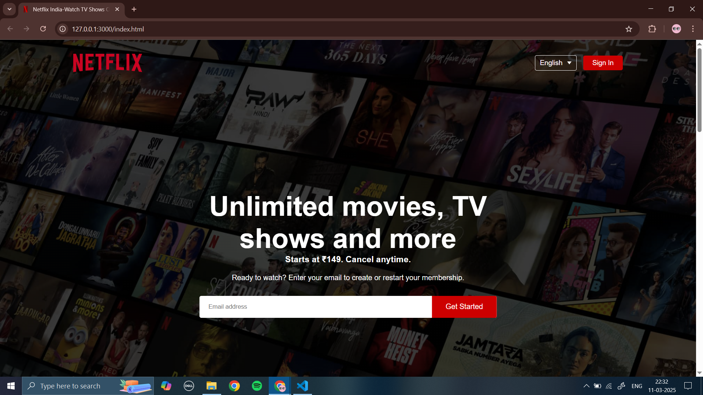

# 🎬 Netflix Clone Website  
A simple, non-functional Netflix clone built using **HTML** and **CSS**. This project replicates the Netflix homepage design for learning and practice purposes.  

## 📸 Preview  


## 🚀 Features  
✅ Responsive design (mobile-friendly)  
✅ Netflix-style homepage UI  
✅ Hover effects on movie thumbnails  
✅ Footer and navigation bar similar to Netflix  

## 🛠️ Technologies Used  
- HTML5  
- CSS3 (Flexbox & Grid)  


## 🔧 How to Use  
1. **Clone this repository**  
   ```sh
   git clone https://github.com/ek-coder/Netflix-Clone-Website.git
2. **Open index.html in a browser**
3. **Enjoy the Netflix UI!**

## 📌 Note
This is a static website with no backend functionality. It is created purely for frontend practice.

## ⭐ Contributing
Feel free to fork this repository and improve the design!

## 📜 License
This project is for educational purposes only and is not affiliated with Netflix.

